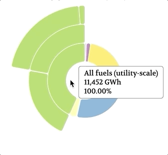

# Electricity-Energy-Generation
Web application that displays electrical energy generated by year and energy source for all US states.
[Live site](https://yongbingao.github.io/Electricity-Energy-Generation/)

## Technologies
- JavaScript
- D3.js
- HTML5
- CSS
- US geographic data obtained through [Census Bureau’s 2018 Cartographic Boundary Files](https://www.census.gov/geographies/mapping-files/time-series/geo/carto-boundary-file.html)
- US energy generation data obtained through [EIA](https://www.eia.gov/)

## Features
### Zoomable sunburst chart



One of the feature of US state's Energy Generation Details sunburst chart is the ability to zoom and focus on one specific energy source. The feature is acheived by defining a tween function that is invoked by a click event. The section of data clicked on will be used as the "parent" dataset represented as the center circle. The tween function recalculates the portion and position of the sunburst chart each subset of data takes up based on the "parent" dataset and the chart is updated to the recalculted values. The tween function is shown below:

```
const x = d3.scaleLinear()
            .range([0, 2 * Math.PI]);

const y = d3.scaleLinear()
            .range([0, radius]);
```

The x varibles represents the "arc", portion of the full circle, that the dataset represents(in radians), and the y varible represents which "layer" of the circle that the dataset is located at (the top level dataset takes the inner circle layer and each sub level dataset takes the next layer of the circle). The range of possible values for x is defined to be 0 - 2*Pi radians for a full circle and possible values for y to be 0 - radius.

```
function click(d) {
    d3.select(".state-details-chart-paths")
        .transition()
        .duration(750)
        .tween("scale", () => {
            const   xd = d3.interpolate(x.domain(), [d.x0, d.x1]),
                    yd = d3.interpolate(y.domain(), [d.y0, 1]),
                    yr = d3.interpolate(y.range(), [d.y0 ? 37.5 : 0, radius]);

            return t => {
                x.domain(xd(t));
                y.domain(yd(t)).range(yr(t));
            };
        })
        .selectAll("path")
        .attrTween("d", d => {
            return () => { 
                return arc(d) 
            };
        })
}
```

In the tween function, the D3.js interpolate function is used to calculate the new domain values for xd and yd, which represents the "arc" and "layer" values for the dataset. The yr variable is defined to replace the y variable previously defined with to have the "parent" dataset that was clicked on to be the top level data that takes the inner circle layer. The function returned from the tween function is then invoked for each sub dataset from the "parent" dataset to update the chart.

### Detail Information Tooltip

The application includes a tooltip that follows the mouse pointer and will show detailed information when hovering over different charts. The code for the tooltip is as follows:

```
document.onmousemove = (event) => {
    document.getElementById("hover-tooltip").style.left = event.pageX + 10 + "px";
    document.getElementById("hover-tooltip").style.top = event.pageY - 35 + "px";
}

usMap.addEventListener("mouseover", e => {
    const name = e.target.__data__.properties.NAME;
    const fullMessage = name.concat(": ", 
        Number(currentYearDataset[name.concat(" : all fuels (utility-scale)")])
            .toLocaleString(), 
        " gigawatthours (GWh)");
    const domEle = document.getElementById("hover-tooltip");
    domEle.innerHTML = fullMessage;
    domEle.style.opacity = 1;
});

usMap.addEventListener("mouseleave", e => {
    document.getElementById("hover-tooltip").innerHTML = "";
    document.getElementById("hover-tooltip").style.opacity = 0;
})
```

The functionality of the tooltip is made up of three parts. The tooltip is created to initially have opacity of 0, or transparent.
 - The onmousemove event will be triggered whenever the mouse pointer moves and the tooltip's position will be set to match the pointer's position.
 - An event listener was added to track whether the mouse pointer hovers over a state on the US map. When it does, the tooltip's text will be changed according to the specific detail energy information and the opacity value will be set to 1, or opaque.
 - A mouse leave event lisenter is also added to clear the the tooltip's text and reset the opacity back to 0.

## Future Features
 - Include energy consumption data
 - Allows data comparasion between different states